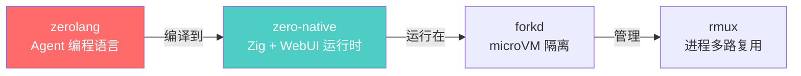

# Vercel zerolang

## 一句话定位
专为 AI Agent 设计的编程语言——Vercel Labs 出品，C 语言实现，Apache 2.0 协议。

## 它解决的问题
当前 Agent 使用通用语言（Python/TypeScript）编写工具和逻辑，但这些语言不是为 Agent 场景设计的。Agent 需要的是：简洁的声明式表达、内建的并行/隔离原语、面向推理优化的执行模型。

## 为什么值得关注（2026-06-05）
Vercel Labs 连续推出 zerolang + zero-native 两个 Agent 基础设施项目，标志 Vercel 在 Agent 运行时方向押注。zerolang 是其中最大胆的赌注：如果 Agent 需要专用语言，先发优势巨大。

## 热度来源判断
- Vercel Labs 品牌效应
- "Agent 编程语言" 定位独特，无直接竞品
- 43 issues + 88 PRs 反映社区积极参与
- C 语言实现暗示高性能取向

## 关键技术亮点
1. **Agent 原生设计**：从零开始为 Agent 场景设计，非通用语言加 Agent 库
2. **C 语言实现**：性能优先，可嵌入其他运行时
3. **Vercel Labs 背景**：Vercel 的前端 + Edge Runtime 经验为 Agent 语言提供了独特视角
4. **88 PRs**：社区贡献活跃，语言生态可能在快速构建中

## 架构启发
- Agent 语言 vs Agent 框架：从「用 Python 写 Agent」到「用 Agent 语言写 Agent」
- 如果成立，将形成新的编译层：zerolang → 目标运行时（V8/WASM/native）
- 与 zero-native（Zig + WebUI）形成 Agent 全栈：语言 + UI + 运行时

## 定位判断
**学习型。** Agent 专用语言是前瞻性赌注，但语言生态建设极其困难。当前更适合学习和观察，距离生产使用还有很长的路。

## 风险 / 局限 / 泡沫点
1. **Vercel Labs 实验性**：Labs 项目通常验证概念后可能被合并到主产品或停止维护
2. **语言生态困境**：新语言最大的挑战不是语法设计，而是生态建设
3. **竞争激烈**：Python + LangChain/CrewAI 已有大量用户基础
4. **定位未验证**：Agent 是否真的需要专用语言？多数 Agent 任务用 Python 就够了

## 与同类项目的关系
- **Python + LangChain/OpenAI Agents SDK**：主流 Agent 编程方式，zerolang 需要证明差异化
- **Mojo (Modular)**：AI 推理语言，但面向推理性能而非 Agent 编程
- **Vercel zero-native (4.1K)**：姊妹项目，Zig + WebUI 跨平台应用

## 是否值得持续跟踪
**建议跟踪。** 即使 zerolang 本身不成功，它的设计理念会启发 Agent 编程范式的演进。

## 后续观察点
1. 语言核心特性发布（类型系统、并行原语、推理优化）
2. Vercel 是否在 Next.js / v0 产品中集成 zerolang
3. 社区是否出现 zerolang 编写的实际 Agent 应用
4. 与 MCP 协议的集成方式

---
*首次记录：2026-06-05*
